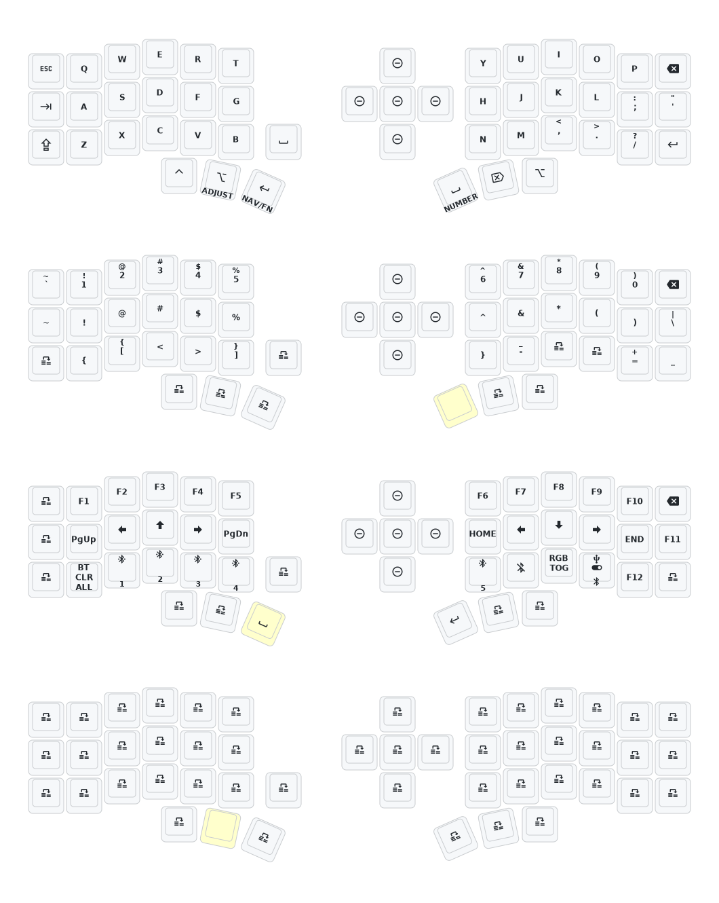

- [English](README_EN.md)

# ZMK Companion Template

The recommended ZMK firmware starting point for
[**zmk-companion**](https://github.com/oscampo/zmk-companion): fork this
repo and GitHub Actions builds you a ready-to-flash firmware with the BLE
display feature already enabled, plus a minimal keymap you make your own.
New to all this? Start with zmk-companion's
[`getting_started.md`](https://github.com/oscampo/zmk-companion/blob/main/docs/getting_started.md)
instead of this file, it walks the whole flow end to end.

Built and tested against the "eyelash_corne" split keyboard hardware
(see below). If you have a different ZMK board with a `nice_view` display,
see "Other boards" further down, the display feature itself isn't tied to
this specific hardware, that part just hasn't been tried elsewhere yet.

## Quick start

1. [Fork this repository](https://docs.github.com/en/get-started/quickstart/fork-a-repo#forking-a-repository).
2. [Open the **Actions** tab and enable workflows](https://docs.github.com/en/actions/managing-workflow-runs-and-deployments/managing-workflow-runs/disabling-and-enabling-a-workflow#enabling-a-workflow)
   if GitHub asks you to.
3. Wait for "Build ZMK firmware" to finish, then download the
   `eyelash_corne_left`/`eyelash_corne_right` artifacts from that run and
   flash each half.
4. Customize your keymap whenever you want, see [Keymap](#keymap) below.

**Already have your own ZMK config repo?** [Add this one as a module instead of forking it](https://zmk.dev/docs/features/modules#building-with-modules),
see "Other boards" below for why that's usually enough to get the display
feature without copying any files.

**Note for forks**: [`config/west.yml`](config/west.yml) already pulls
`boards/arm/eyelash_corne` from its upstream URL. If your fork still has a
local `boards/arm/eyelash_corne` folder alongside that (it may, depending on
how you forked), delete the local copy, the west-fetched one is what's
actually used.

## BLE Keyboard Display

The actual feature this template exists for: a BLE GATT service
(`config/custom_status_screen.c`) that renders live data (clock, weather,
custom text, whole page layouts) on the keyboard's `nice_view` display, fed
by the zmk-companion Windows app. See its
[user guide](https://github.com/oscampo/zmk-companion/blob/main/docs/user_guide.md)
for what it can do.

Forking this repo already gets it: `build.yaml` enables it
(`CONFIG_KBD_BLE_DISPLAY=y`) for the `eyelash_corne_left` build (the split's
central half), so the `.uf2` GitHub Actions produces for that board already
has it, nothing extra to build.

**Other boards**: the display code has no eyelash_corne-specific
dependencies, it only needs the standard `nice_view` shield and a split ZMK
board (it runs on the central half only). Since this repo is already usable
as a west module, you likely don't need to fork it or copy any files: add
it as a module in your own config's `west.yml` and build your own board
with `-DCONFIG_KBD_BLE_DISPLAY=y`. This hasn't been verified on a board
other than eyelash_corne, if you try it, please open an issue (here or on
zmk-companion) with the result either way, working or not, so this note
can stop being a guess.

**Power-cycle both halves together**: turning only one half off and back
on (central or peripheral) while the other stays powered can leave the two
sides' internal sync mismatched, showing up as pages flashing briefly then
going blank in no consistent order. Confirmed with `zmk-companion`'s own
debug log showing every BLE write succeeding while this happens, so it's a
central/peripheral sync issue on the keyboard's own firmware, not something
the app can detect or fix. Always power both halves off and on together.

## Keymap

`config/eyelash_corne.keymap` is intentionally minimal: plain QWERTY, a
number layer, a nav/function layer, and an empty layer reserved for your
own use, no personal macros, combos, or custom hold-tap behaviors. It's a
starting point, not a finished layout, edit it to match how you actually
type. The easiest way is
[nickcoutsos.github.io/keymap-editor](https://nickcoutsos.github.io/keymap-editor/),
point it at your fork; edits there commit straight to `config/eyelash_corne.keymap`
and GitHub Actions rebuilds automatically. You can also edit the file by
hand, see [ZMK's keymap docs](https://zmk.dev/docs/keymaps) for the syntax.

**Jumping to a Canvas page on demand**: `adjust_layer` has a commented
example showing how to bind spare keys to `F13`-`F21`, which
`zmk-companion` picks up as global hotkeys to jump straight to page 1-9,
see its
[user guide](https://github.com/oscampo/zmk-companion/blob/main/docs/user_guide.md#pages)
for why F13+ specifically (short version: almost nothing else uses them,
so they won't collide with a shortcut you already rely on).

## Keymap Diagram

## Hardware

**This keyboard is not the same as [foostan's Corne](https://github.com/foostan/crkbd). It will not work with standard `corne` firmware.**

This repo's board definitions originate from the "睫毛外设" (Eyelash
Peripherals) vendor's own ZMK config for this keyboard. For a 3D model of
the physical keyboard itself, contact the vendor at `380465425@qq.com`,
that's hardware support, unrelated to zmk-companion or this template.
